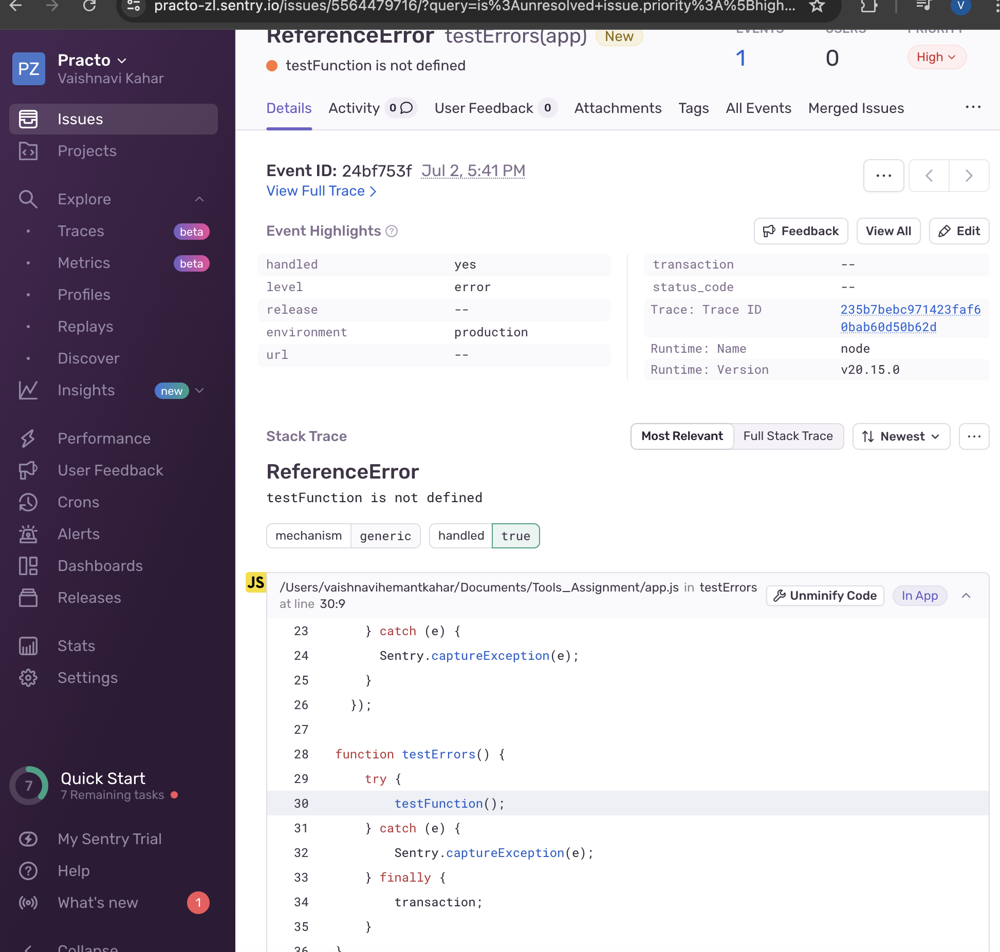

# Question 1

Create an application and integrate sentry with it. Push error messages to the sentry.


## Setup

### 1. Clone the Repository

```bash
git clone https://github.com/Vaishnavi-Kahar/practoToolsAssignment.git
```
### 2. Install Dependencies

```bash
npm install
```

### 3. Login to sentry account and create new node project then set environement variables in .env file

```bash
DSN=your_sentry_dsn_here
```

### 4.Running the Application
To start the application, run:

```bash
node app.js
```

Screenshot of error captured by sentry:

